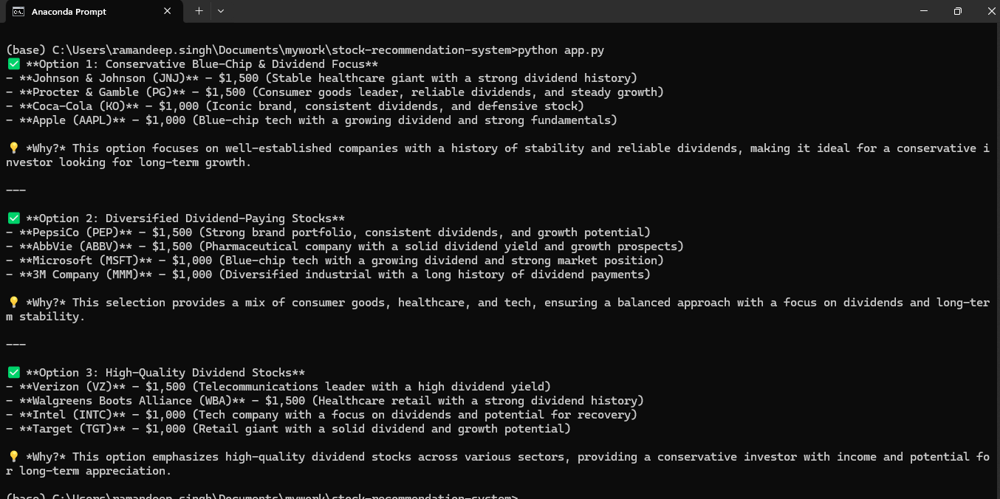

# 📈 Stock Recommender System

## 🚀 Overview
The **Stock Recommender System** is a powerful AI-driven tool that helps users make informed investment decisions by leveraging **OpenAI's language model** and real-time market data. Built with **Streamlit**, the application provides stock recommendations based on historical trends, news sentiment, and AI-driven insights.

## ✨ Features
- 🔍 **AI-Powered Stock Recommendations**: Utilizes OpenAI's model to analyze market trends and suggest potential stocks.
- 🌐 **Interactive UI with Streamlit**: User-friendly interface for seamless navigation and insights visualization.

## 🛠️ Tech Stack
- **Frontend**: Streamlit
- **Backend**: Python
- **AI Model**: OpenAI API (GPT-based recommendations)
- **Data Sources**: Yahoo Finance, Alpha Vantage, or other market data APIs

## 🔧 Installation
1. Clone this repository:
   ```sh
   git clone https://github.com/yourusername/stock-recommender.git
   cd stock-recommender
   ```
2. Create a virtual environment and activate it:
   ```sh
   python -m venv venv
   source venv/bin/activate  # On Windows use `venv\Scripts\activate`
   ```
3. Install dependencies:
   ```sh
   pip install -r requirements.txt
   ```
4. Set up API keys:
   - Get an API key from OpenAI (for recommendations)
   - Create a `.env` file and add the following:
     ```sh
     OPENAI_API_KEY=your_openai_api_key
     ```

5. Run the Streamlit app:
   ```sh
   streamlit run app.py
   ```

## 📷 Screenshots


## 📌 Usage
1. View AI-powered insights, sentiment analysis, and key stock metrics.
2. Get buy/sell/hold recommendations based on AI predictions.
3. Make informed decisions with real-time data and AI analysis.

## 🚀 Future Enhancements
- ✅ Implement portfolio tracking.
- ✅ Add more advanced AI models for better predictions.
- ✅ Enhance UI with interactive visualizations.
- ✅ Support multiple stock exchanges.

## 🤝 Contributing
We welcome contributions! Feel free to fork the repository, open an issue, or submit a pull request.

## 📝 License
This project is licensed under the [MIT License](LICENSE).

## 📬 Contact
- **Author**: Your Name
- **GitHub**: [yourusername](https://github.com/yourusername)
- **LinkedIn**: [Your LinkedIn Profile](https://linkedin.com/in/yourprofile)
- **Twitter**: [@yourhandle](https://twitter.com/yourhandle)